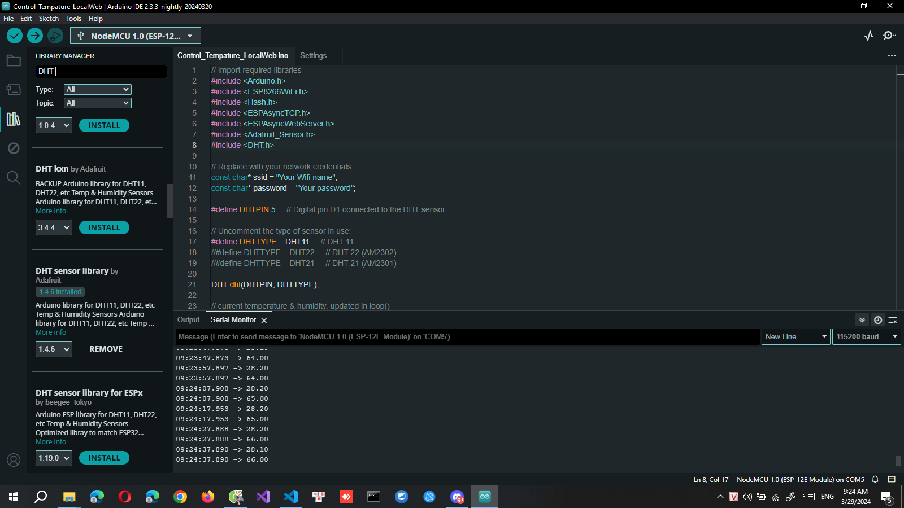
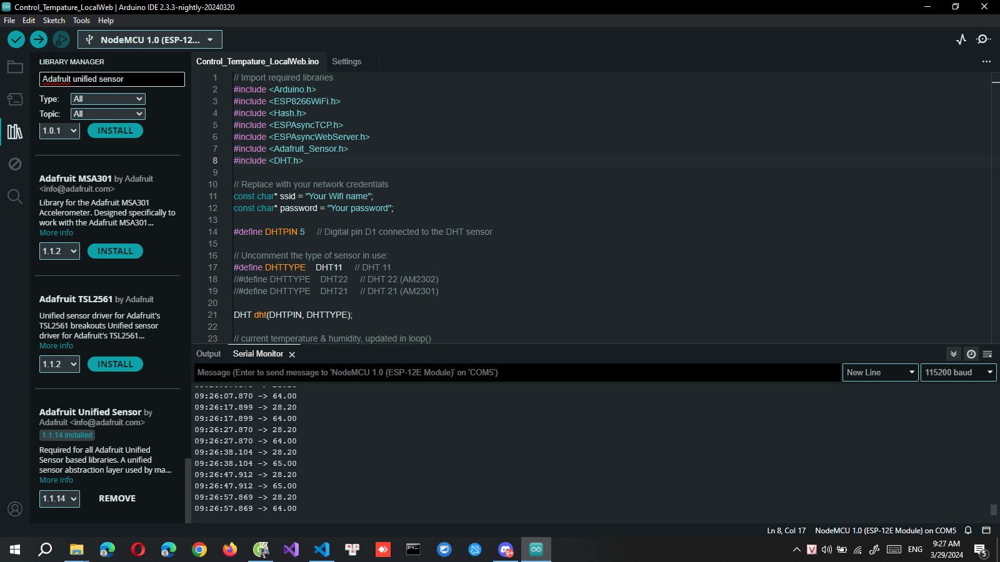
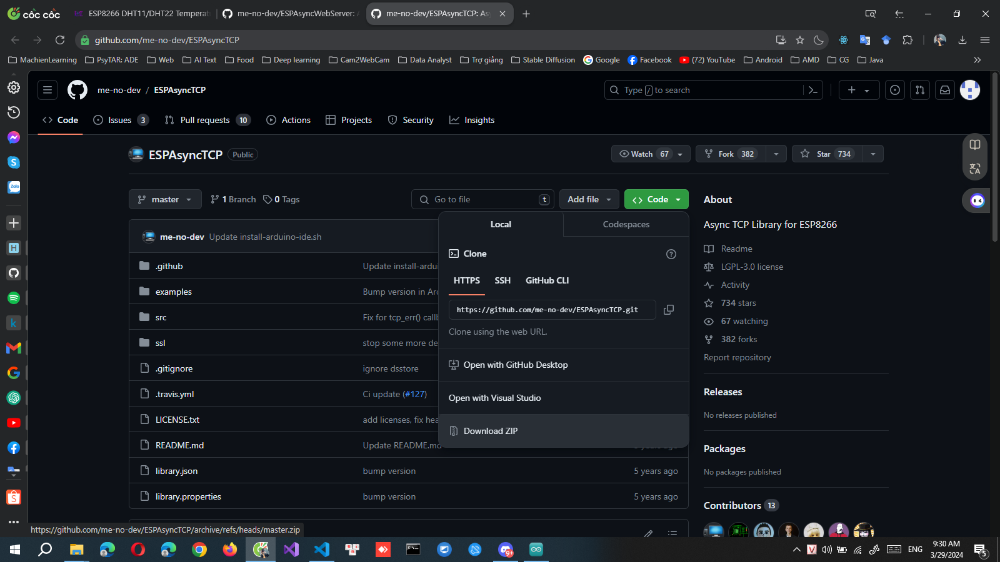
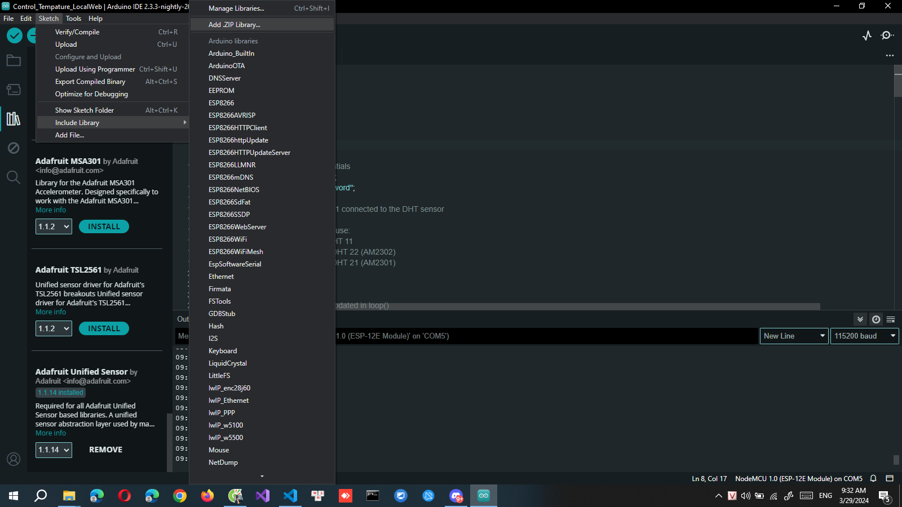
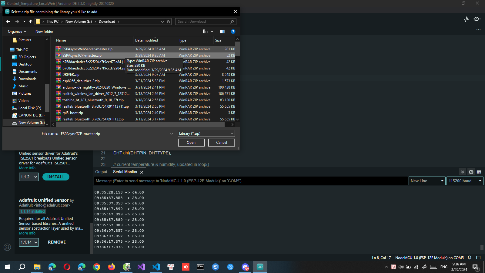

# Arduino-Tempature-Local-Web
Tải drive CH340:
https://drive.google.com/file/d/1KOx5DH5as7AcL48wE-QNbwztq76W_7OY/view
File json của package ESP8266:
https://arduino.esp8266.com/stable/package_esp8266com_index.json
Cài đặt thư viện DHT cho NodeMCU ESP8266:
1. Mở Arduino IDE chọn Sketch > Include Libraries > Manage Libraries. Libraries Manage sẽ hiện lên.
2. Tìm kiếm "DHT" và cuộn chuột xuống, tìm đến thư viện "DHT sensor library by Adafruit" và cài đặt.

3. Cài đặt thư viện "Adafruit unified sensor" nếu có yêu cầu.

4. Cài đặt thư viện ESPAsyncWebServer và ESPAsyncTCP từ 2 link sau:
ESPAsyncWebServer: https://github.com/me-no-dev/ESPAsyncWebServer
ESPAsyncTCP: https://github.com/me-no-dev/ESPAsyncTCP
Sau khi nhấn vào link, chọn Code > Download ZIP

Sau khi tải file zip của 2 thư viện trên, mở Arduino IDE chon Sketch > Include Libraries > Add .ZIP Library. Cửa sổ chọn file ZIP hiện lên.

Di chuyển đến thư mục vửa tải 2 thư viện và chọn từng thư viện.

Để tìm hiểu thêm: 
https://iotprojectsideas.com/esp8266-dht11-dht22-temperature-humidity-with-local-web-server

Lưu ý: Nên để code và thư viện cùng 1 folder
